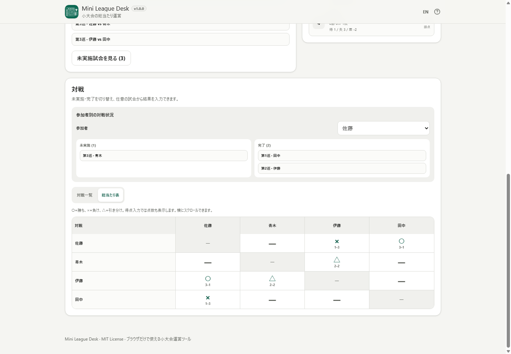

# Mini League Desk / ミニリーグ運営

[](https://github.com/ttomohisa/htmlapps-mini-league-desk/actions/workflows/deploy-pages.yml)
[](LICENSE)
[](https://ttomohisa.github.io/htmlapps-mini-league-desk/)

[English README](README.md)

Mini League Desk は、小規模な総当たり大会をブラウザだけで運営するローカル処理ツールです。総当たり表の作成、結果・点数の記録、残り試合、順位確認までを、登録不要で1台のブラウザから進められます。

現在の安定版: **v1.0.1**

v1.0.1では、順位表PNGの英語の勝敗見出しが隣の列へ重ならないようにしました。順位計算、出力値、アプリ画面の操作は変更していません。

## 🚀 デモ

### [GitHub PagesでMini League Deskを開く](https://ttomohisa.github.io/htmlapps-mini-league-desk/)

GitHub Pagesから最初のHTMLを読み込んだ後、大会名、参加者名、対戦表、結果、順位、端末内保存、出力データはブラウザ内で処理します。入力した大会データをアプリがサーバーへ送信する処理はありません。

[](https://ttomohisa.github.io/htmlapps-mini-league-desk/)

スマートフォン版: [assets/screenshot-mobile.png](assets/screenshot-mobile.png)

## Features / できること

- **小規模な総当たり大会をすぐ始める** — 3〜64人の参加者を追加し、大会名、参加者順、結果入力方式を設定できます。
- **総当たり表を○ / × / △で確認する** — 対戦一覧と参加者×参加者の表を切り替え、**○=勝ち / ×=負け / △=引き分け / —=未実施**で確認できます。
- **勝敗と点数を同時に残す** — 得点入力では、結果記号を残したまま **○ / 3–1**、反対側は **× / 1–3** のように点数を併記します。
- **次に必要な情報をすぐ見る** — 進行状況、次の試合候補、残り対戦相手、完了済み試合、現在順位を大会中に確認できます。
- **入力ミスを直しやすい** — 結果の修正・取消、参加者名の編集、並べ替え、対応操作のUndoを利用できます。
- **大会データを端末内に残す** — 進行中の大会をブラウザへ自動保存し、JSONバックアップ / 復元で持ち運べます。
- **必要な形式で出力する** — 対戦結果CSV、順位CSV、順位表PNG、印刷に対応します。
- **PC / スマートフォン、日本語 / 英語に対応する** — スマホ下部ナビゲーション、狭幅対応、キーボードフォーカス、アクセシブルネームを含みます。
- **実行時の外部通信へ依存しない** — standalone版はCSP `connect-src 'none'` を維持し、実行時CDN、API、分析、テレメトリ、外部フォント、サードパーティ実行ライブラリへ依存しません。

## Quick start / すぐ使う

### Web版を使う

[デモを開く](https://ttomohisa.github.io/htmlapps-mini-league-desk/)だけです。インストールやアカウント登録は不要です。

### 単一HTMLとして使う

1. このリポジトリをダウンロードまたはcloneします。
2. Windowsで `.\build-standalone.bat` を実行します。
3. 生成された `dist/index.html` をブラウザで直接開きます。
4. そのHTMLを別の場所へコピーして、Webサーバーなしでも利用できます。

ビルドでは `dist/index.self-extract.html` と、リポジトリ直下の読みやすいコピー `mini-league-desk.html` も生成します。

## 使い方

1. 必要なら大会名を入力します。
2. 結果入力方式を選びます。
   - 勝敗だけ
   - 勝ち・引き分け
   - 得点入力
3. 参加者を3人以上追加します。1人ずつ追加するほか、複数人の名前をまとめて貼り付けられます。
4. 必要ならドラッグハンドルまたは矢印ボタンで参加者順を変更し、参加者を確定します。
5. **進行** で大会の完了状況と次の試合候補を確認します。
6. **対戦** で対戦一覧と総当たり表を切り替えます。
7. 試合行または総当たり表のセルを選び、結果を入力します。得点入力では両者の点数から○ / × / △を自動判定します。
8. **順位** で現在順位を確認します。
9. **出力** からCSV、PNG、印刷を利用します。
10. 大切な大会ではJSONバックアップも保存しておくと、ブラウザのサイトデータ消去後や別端末への移動時に復元できます。

## 順位ルール

**勝敗だけ** は勝ち1 / 負け0です。

**勝ち・引き分け** と **得点入力** は勝ち3 / 引き分け1 / 負け0です。

得点入力では次の順で順位を判定します。

1. 勝点
2. 得失点差
3. 得点

有効な判定項目がすべて同じ場合は同順位です。参加者の登録順で見かけ上の順位差を付けません。

## 端末内保存・バックアップ・出力

進行中の大会はブラウザのローカルストレージへ保存し、通常の再読み込みでは結果やLeague Deskの表示状態を含めて復元します。

ブラウザやOSの操作でサイトデータが消える可能性はあります。重要な大会ではJSONバックアップを併用してください。

大会中に利用できる出力:

- 対戦結果CSV
- 順位CSV
- 順位表PNG
- 印刷
- JSONバックアップ / 復元

CSVはUTF-8 BOM付きで、ユーザー入力が表計算ソフトの数式として解釈されにくいよう保護します。ファイル出力では、保存前に安全化されたファイル名を編集できます。

## プライバシーと実行時通信

Mini League Deskの大会データはブラウザ内で処理します。

アプリ本体には次の実行時依存がありません。

- CDN
- アプリ用API
- Analytics / telemetry
- 外部フォント
- サードパーティの実行時ライブラリ

Content Security Policyには `connect-src 'none'` を設定しています。

JSONはユーザーが明示的にバックアップファイルを選択した場合だけ読み込みます。CSV / PNG / JSONも、ユーザーが出力操作をした場合だけ生成します。

GitHub Pages版では最初のHTML取得の通信は発生します。ネットワークから切り離して使う場合は、ローカルで `dist/index.html` をビルドして直接開いてください。

## v1.0.0 リリース検証

v1.0.0では以下を自動確認します。

- 3 / 4 / 5 / 8 / 16人の明示ケース
- 3〜64人の総当たり不変条件
- 勝敗、引き分け、得点、同順位、結果修正 / 取消、Undo
- 大会完了と再開
- 端末内保存と不正 / 非対応JSON読込の拒否
- CSV / PNG / 印刷
- 日本語 / 英語i18n整合とAccessibilityマーカー
- 日英それぞれのPC / スマートフォン用リリースアセット
- favicon / Browser Kittyブランドカラー
- 通常standalone / self-extract / リポジトリ直下HTMLの生成
- CSP / 実行時通信遮断
- 参加者のドラッグ・追加フロー、総当たり表の記号＋得点表示のブラウザSmoke

自動検証だけで、実スクリーンリーダー、OSの印刷ダイアログ、実スマートフォン端末、DevTools Networkパネルを手動確認済みとは扱いません。

## 対応ブラウザ

主要対象:

- 現行Chrome
- 現行Edge

Best effort:

- 現行Firefox
- 現行Safari
- Chrome for Android
- Safari on iPhone

## 制限事項

- v1.0.0は総当たり大会専用です。トーナメント、スイス式、グループ戦＋決勝トーナメントには対応しません。
- アカウント、クラウド同期、観戦用公開URL、リアルタイムの複数端末共同運営はありません。
- 進行中の大会はブラウザ内に保存します。サイトデータを消去すると、JSONバックアップがない場合は復元できません。
- 得点入力の順位判定は「勝点 → 得失点差 → 得点」です。直接対決によるタイブレークは含みません。
- 参加者の上限は64人です。1台のブラウザで扱いやすい小規模大会を主用途にしています。

## 開発とビルド構成

```text
.
├─ src/index.template.html       # 編集対象のアプリ本体
├─ app.config.json               # アプリ情報とv1.0.1バージョン
├─ assets/
│  ├─ favicon.svg
│  ├─ screenshot.png
│  ├─ screenshot-mobile.png
│  ├─ screenshot-en.png
│  └─ screenshot-mobile-en.png
├─ scripts/                      # 検証・回帰テスト
├─ build-standalone.bat          # Windows用ビルド入口
└─ .github/workflows/            # CI / Pages / PR Preview
```

変更前に `AGENTS.md`、`APP_SPEC.md`、`docs/ARCHITECTURE.md`、`docs/LLM_WORKFLOW.md` を確認してください。

ビルド:

```powershell
.\build-standalone.bat
```

リポジトリ検証:

```powershell
powershell.exe -NoLogo -NoProfile -ExecutionPolicy Bypass -File .\scripts\check-powershell-syntax.ps1
powershell.exe -NoLogo -NoProfile -ExecutionPolicy Bypass -File .\scripts\check-repository.ps1
```

現在の `dependencies.json` は空で、Mini League Desk本体にサードパーティの実行時パッケージ依存はありません。

## Contributing

不具合報告や機能提案はGitHub Issuesから受け付けています。開発時は [CONTRIBUTING.md](CONTRIBUTING.md) も参照してください。

## ライセンス

Copyright © 2026 ttomohisa

[MIT License](LICENSE) で公開しています。通知情報は [THIRD_PARTY_NOTICES.md](THIRD_PARTY_NOTICES.md) を参照してください。
