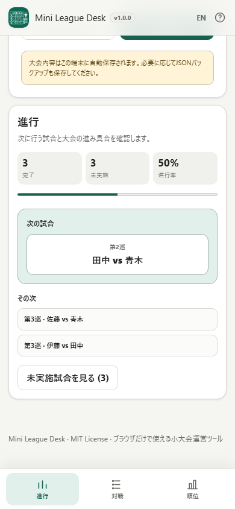

# Mini League Desk / ミニリーグ運営

[English README](README.md)

Mini League Desk は、小規模な総当たり大会をブラウザだけで運営するローカル処理ツールです。**「次は誰と誰？」「まだどの試合が残っている？」「今の順位は？」**を大会中にすぐ確認できることを中心にしています。

現在のリリース候補: **v0.9.0**

## スクリーンショット

### PC


### スマートフォン



## できること

- 任意の大会名
- 3〜64人の参加者
- 奇数人数の「休み」を含む総当たり対戦表
- 参加者一覧の下から「＋参加者を追加」「＋複数人をまとめて追加」
- 参加者名を一覧内で編集
- ドラッグハンドル / キーボード操作可能な矢印ボタンで参加者順を変更
- 3種類の結果記録方式
  - 勝敗だけ
  - 勝ち・引き分け
  - 得点入力
- 結果の登録 / 修正 / 取消 + Undo
- 同順位を含むリアルタイム順位計算
- 進行 / 対戦 / 順位の大会運営フロー
- 「対戦」では対戦一覧と、参加者×参加者の総当たり表を切り替え
- 対戦順を強制しない「次の試合」候補
- 参加者別の未実施相手 / 完了相手
- 全試合終了時の自動完了・最終順位
- 大会内容の端末内自動保存
- JSONバックアップ / 復元
- 対戦結果CSV
- 順位CSV
- Canvasで生成する順位表PNG
- 順位と全対戦結果の印刷
- 日本語 / 英語UI
- スマホ下部ナビゲーション・狭幅対応
- キーボードフォーカス、ローカライズ済みアクセシブルネーム、ARIA選択状態

## 順位ルール

「勝敗だけ」は勝ち1 / 負け0です。

「勝ち・引き分け」と「得点入力」は勝ち3 / 引き分け1 / 負け0です。

得点入力では次の順で順位を判定します。

1. 勝点
2. 得失点差
3. 得点

有効な判定項目がすべて同じ場合は同順位です。参加者の登録順で見かけ上の順位差を付けません。

## ローカル処理とプライバシー

大会名、参加者、対戦表、結果、順位、端末内保存データ、JSON / CSV / PNGの生成データはブラウザ内で処理します。

実行時CDN、API、分析タグ、テレメトリ、外部フォントへの依存はありません。Content Security Policyは `connect-src 'none'` を維持します。

JSONはユーザーが明示的に選択した場合だけ読み込み、出力ファイルもユーザーが明示的に実行した場合だけ生成します。

## 端末内保存

進行中の大会はブラウザのローカルストレージへ保存し、通常の再読み込みでは結果やLeague Deskの表示状態を含めて復元します。

ブラウザやOSの操作でサイトデータが消える可能性はあるため、大切な大会ではJSONバックアップも利用してください。

## 出力

大会中の **出力** から以下を利用できます。

- 対戦結果CSV
- 順位CSV
- 順位表PNG
- 印刷

CSVはUTF-8 BOM付きで、ユーザー入力が表計算ソフトの数式として解釈されにくいよう保護します。ファイル出力では保存前に安全化されたファイル名を編集できます。

## Accessibility / スマートフォン

- スマホでは進行 / 対戦 / 順位を下部固定タブで切り替え
- safe areaを考慮し、下部UIで操作可能な内容を隠さない
- 390 CSS pxのリリース撮影で横スクロールなしを確認
- 結果入力はタッチしやすい操作領域
- 長い参加者名を折り返して表示
- フィルター・現在の結果を `aria-pressed` でも表現
- ダイアログ終了後は可能な範囲で元の操作位置へフォーカス復帰
- reduced motion / forced-colors対応

## v0.9.0 リリース候補の検証

リポジトリ検証では少なくとも以下を自動確認します。

- 3 / 4 / 5 / 8 / 16人の明示ケース
- 3〜64人の総当たり不変条件
- 同率・得点・同順位
- 結果修正 / 取消 / Undo
- 大会完了と再開
- 端末内保存と不正JSON読込の拒否
- Mobile / UX回帰
- 日本語 / 英語i18n整合とAccessibilityマーカー
- CSV / PNG / 印刷
- 日英それぞれのPC / スマホスクリーンショット
- favicon / ブランドカラー
- 通常standalone / self-extract
- リポジトリ直下の通常HTML
- CSP / 実行時通信遮断

自動検証だけで、実スクリーンリーダー、OSの印刷ダイアログ、実スマートフォン端末、DevTools Networkパネルを手動確認済みとは扱いません。

## 単一HTML / オフライン利用

ビルドでは以下を生成します。

- `dist/index.html`
- `dist/index.self-extract.html`
- `mini-league-desk.html`

通常版HTMLは `file://` で直接開いて利用できる構成です。

## 対応ブラウザ

主要対象:

- 現行Chrome
- 現行Edge

Best effort:

- 現行Firefox
- 現行Safari
- Chrome for Android
- Safari on iPhone

## 開発

変更前に `AGENTS.md`、`APP_SPEC.md`、`docs/ARCHITECTURE.md`、`docs/LLM_WORKFLOW.md` を確認してください。

編集対象は `src/index.template.html` です。

## ビルド

```powershell
.\build-standalone.bat
```

リポジトリ検証:

```powershell
powershell.exe -NoLogo -NoProfile -ExecutionPolicy Bypass -File .\scripts\check-powershell-syntax.ps1
powershell.exe -NoLogo -NoProfile -ExecutionPolicy Bypass -File .\scripts\check-repository.ps1
```

## ライセンス

MIT。詳細は [LICENSE](LICENSE) と [THIRD_PARTY_NOTICES.md](THIRD_PARTY_NOTICES.md) を参照してください。
