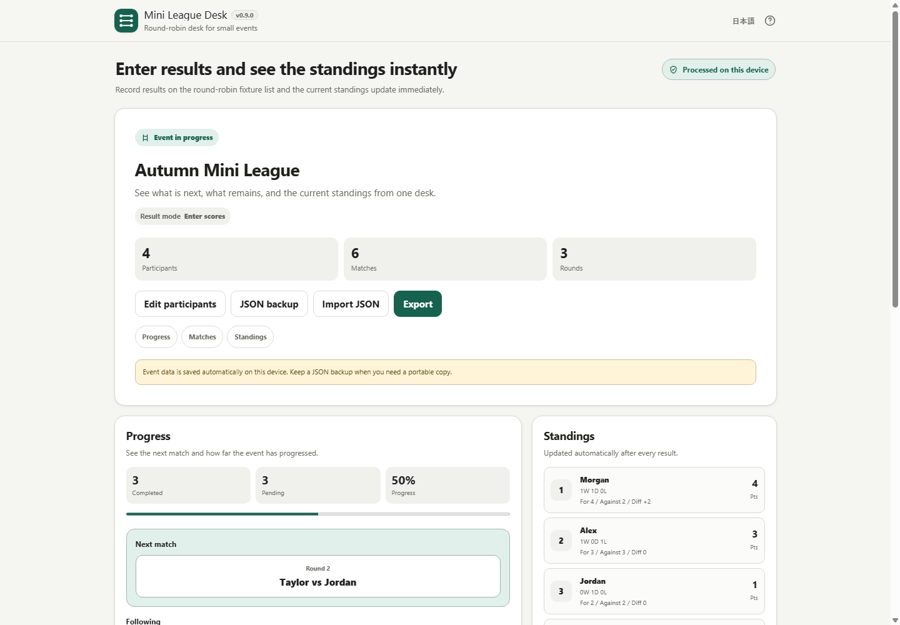

# Mini League Desk

[](https://github.com/ttomohisa/htmlapps-mini-league-desk/actions/workflows/deploy-pages.yml)
[](LICENSE)
[](https://ttomohisa.github.io/htmlapps-mini-league-desk/)

[日本語版 README](README.ja.md)

Mini League Desk is a privacy-focused browser tool for running small round-robin events. It generates the schedule, records results and scores, shows remaining matches and standings, and keeps the active event on the device without requiring an account.

Current stable release: **v1.0.1**

v1.0.1 keeps the full English record heading inside its column in exported standings PNGs. Scoring rules, export values, and the application UI are unchanged.

## 🚀 Live demo

### [Open Mini League Desk on GitHub Pages](https://ttomohisa.github.io/htmlapps-mini-league-desk/)

GitHub Pages delivers the initial HTML. After it loads, event names, participant names, fixtures, results, standings, local saves, and generated exports are handled in the browser. The app does not send entered event data to a server.

[](https://ttomohisa.github.io/htmlapps-mini-league-desk/)

Smartphone screenshot: [assets/screenshot-mobile-en.png](assets/screenshot-mobile-en.png)

## Features

- **Set up a round-robin event quickly** — Add 3–64 participants, optionally name the event, reorder the roster, or shuffle it.
- **Use the whole-event round-robin table** — Switch between match list and participant × participant matrix views. Cells show **○ = win, × = loss, △ = draw, — = pending**.
- **Keep scores as well as outcomes** — In score-entry mode, the matrix keeps the result symbol and shows the row participant's score underneath, such as **○ / 3–1** and **× / 1–3**.
- **See what needs attention next** — Progress, suggested next matches, remaining opponents, completed matches, and live standings stay available during the event.
- **Correct mistakes without rebuilding the event** — Edit or remove results, rename participants, reorder the roster, and use Undo for supported actions.
- **Keep and move event data locally** — The active event is saved in browser storage, with JSON backup / restore for portability.
- **Export practical results** — Save match-results CSV, standings CSV, a locally generated standings PNG, or print standings and all match results.
- **Use it on desktop or phone** — Japanese / English UI, smartphone bottom navigation, narrow-screen handling, visible keyboard focus, and accessible labels are included.
- **Run without runtime network dependencies** — The standalone build uses CSP `connect-src 'none'` and has no runtime CDN, API, analytics, telemetry, remote-font, or third-party library dependency.

## Quick start

### Use the web demo

Open the [live demo](https://ttomohisa.github.io/htmlapps-mini-league-desk/). No installation or account is required.

### Use it as a standalone HTML file

1. Download or clone this repository.
2. Run `.\build-standalone.bat` on Windows.
3. Open `dist/index.html` directly in your browser.
4. You can copy that HTML file elsewhere and use it later without a web server.

The build also produces `dist/index.self-extract.html` and the repository-root readable copy `mini-league-desk.html`.

## Usage

1. Optionally enter an event name.
2. Choose the result mode:
   - Win / loss
   - Win / draw / loss
   - Score entry
3. Add at least three participants. You can add one person at a time or paste multiple names.
4. Reorder participants with the drag handle or arrow buttons if needed, then confirm the roster.
5. Use **Progress** to see completion status and suggested next matches.
6. Use **Matches** to switch between the match list and the round-robin table.
7. Select a match cell or match row and enter the result. In score mode, enter both scores and the app derives ○ / × / △ automatically.
8. Use **Standings** to review the current ranking.
9. Use **Export** for CSV, PNG, or print output.
10. For important events, also export a JSON backup so the event can be restored after browser/site data is cleared or moved to another device.

## Ranking rules

**Win / loss** uses win = 1 and loss = 0.

**Win / draw / loss** and **Score entry** use win = 3, draw = 1, loss = 0.

Score-based standings sort by:

1. league points
2. score difference
3. score for

If all active tiebreak values are identical, participants share the same rank. Registration order is not used to create a false sporting rank.

## Local save, backup, and export

The active event is saved to browser local storage and normally returns after reload, including results and League Desk UI state.

Browser or operating-system actions can still clear site data. JSON backup is therefore the recovery and portability path for important events.

Exports available during an event:

- Match Results CSV
- Standings CSV
- Standings PNG
- Print
- JSON backup / restore

CSV output uses UTF-8 with BOM and protects user-controlled text that begins with common spreadsheet formula prefixes. File-producing exports use an editable, sanitized filename.

## Privacy and runtime network protection

Mini League Desk processes event data locally in the browser.

The app has:

- no runtime CDN
- no application API
- no analytics or telemetry
- no remote font dependency
- no third-party runtime library dependency
- a runtime Content Security Policy containing `connect-src 'none'`

JSON is read only when you explicitly choose a backup file. CSV / PNG / JSON files are generated only when you explicitly export them.

The GitHub Pages version naturally requires an initial request for the HTML itself. For use with the network disconnected, build and open `dist/index.html` locally.

## Release verification

The v1.0.0 release checks cover:

- explicit 3 / 4 / 5 / 8 / 16 participant cases
- broader 3–64 round-robin pairing invariants
- win/loss, draw, score, shared-rank, result edit/remove, and Undo behavior
- event completion and reopen behavior
- local persistence and malformed/incompatible JSON import rejection
- CSV / PNG / print export markers
- Japanese / English i18n parity and accessibility markers
- current Japanese / English desktop and smartphone release assets
- favicon and Browser Kitty brand color
- readable standalone, self-extract standalone, and repository-root HTML generation
- CSP and runtime-network blocking
- browser smoke coverage for participant drag/add flows and round-robin symbol/score rendering

Automated checks do not claim a real screen-reader walkthrough, OS print-dialog review, real smartphone-device test, or manual DevTools network-panel inspection.

## Browser support

Primary targets:

- current Chrome
- current Edge

Best effort:

- current Firefox
- current Safari
- Chrome for Android
- Safari on iPhone

## Limitations

- Mini League Desk supports round-robin events only. Knockout brackets, Swiss pairing, and group-stage + knockout formats are outside v1.0.0.
- It does not provide accounts, cloud synchronization, spectator publishing URLs, or real-time multi-device collaboration.
- The active event lives in browser storage. Clearing site data can remove it unless you exported a JSON backup.
- Score-mode tiebreaks are league points → score difference → score for. Direct head-to-head tiebreaking is not included.
- The hard participant limit is 64; the product is designed primarily for small events where operating the league from one browser remains practical.

## Development and build layout

```text
.
├─ src/index.template.html       # Editable application source
├─ app.config.json               # App metadata and v1.0.1 version
├─ assets/
│  ├─ favicon.svg
│  ├─ screenshot.png
│  ├─ screenshot-mobile.png
│  ├─ screenshot-en.png
│  └─ screenshot-mobile-en.png
├─ scripts/                      # Verification and regression checks
├─ build-standalone.bat          # Windows build entry point
└─ .github/workflows/            # CI, Pages deployment, and PR preview
```

Before changing the app, read `AGENTS.md`, `APP_SPEC.md`, `docs/ARCHITECTURE.md`, and `docs/LLM_WORKFLOW.md`.

Build:

```powershell
.\build-standalone.bat
```

Repository verification:

```powershell
powershell.exe -NoLogo -NoProfile -ExecutionPolicy Bypass -File .\scripts\check-powershell-syntax.ps1
powershell.exe -NoLogo -NoProfile -ExecutionPolicy Bypass -File .\scripts\check-repository.ps1
```

`dependencies.json` is currently empty, so Mini League Desk does not require a third-party runtime package.

## Contributing

Bug reports and feature proposals are welcome through GitHub Issues. See [CONTRIBUTING.md](CONTRIBUTING.md) for development guidance.

## License

Copyright © 2026 ttomohisa

Licensed under the [MIT License](LICENSE). See [THIRD_PARTY_NOTICES.md](THIRD_PARTY_NOTICES.md) for notice information.
