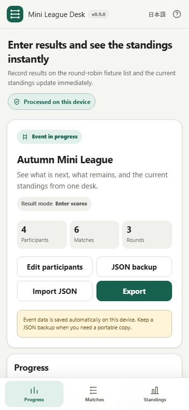

# Mini League Desk

[日本語版 README](README.ja.md)

Mini League Desk is a local-first browser tool for running small round-robin events. It is designed around quickly answering: **who plays next, what is still unfinished, and what are the current standings?**

Current release candidate: **v0.9.0**

## Screenshots

### Desktop


### Smartphone



## What it does

- Event setup with an optional event name
- 3–64 participants
- Round-robin fixtures with automatic Bye handling for odd rosters
- Participant management from one list: add one, add multiple, rename, remove, shuffle, and reorder
- Participant ordering by drag handle or keyboard-accessible arrow buttons
- Three result modes:
  - Win / loss
  - Win / draw / loss
  - Score entry
- Result add / edit / removal with Undo
- Live standings with shared-rank handling
- Progress / Matches / Standings workflow
- Matches can switch between a round/list view and an interactive round-robin table
- Suggested next match without forcing match order
- Per-participant remaining and completed opponents
- Automatic event completion and final standings
- Local automatic save
- JSON backup / restore
- Match Results CSV
- Standings CSV
- Local Canvas Standings PNG
- Print layout for standings and every match
- Japanese / English UI
- Smartphone bottom navigation and narrow-screen layout
- Keyboard-visible focus, localized accessible labels, and selected-state ARIA

## Ranking rules

Win/Loss mode uses win = 1 and loss = 0.

Win/Draw/Loss and Score modes use win = 3, draw = 1, loss = 0.

For score-based events, standings sort by:

1. league points
2. score difference
3. score for

If all active tiebreak values are identical, participants share the same rank. Registration order is never used to create a false sporting rank.

## Local processing and privacy

Event names, participants, fixtures, results, standings, locally saved event data, and generated JSON / CSV / PNG output are processed in the browser.

The app has no runtime CDN, API, analytics, telemetry, or remote-font dependency. The runtime Content Security Policy keeps `connect-src 'none'`.

JSON files are only read when you explicitly choose one, and output files are only created when you explicitly export them.

## Persistence

The active event is saved in browser local storage. A normal reload restores the event, including results and League Desk UI state.

Browser/site data can still be cleared by the browser or operating system, so JSON backup is the portability and recovery path for important events.

## Export

The in-event **Export** action provides:

- Match Results CSV
- Standings CSV
- Standings PNG
- Print

CSV output uses UTF-8 with BOM and protects user-controlled text that begins with common spreadsheet formula prefixes. File-producing exports use an editable, sanitized file name.

## Accessibility and mobile

- Progress / Matches / Standings become fixed bottom tabs on phones
- safe-area spacing prevents the bottom bar from hiding reachable content
- 390 CSS px release capture reports no horizontal overflow
- result controls use mobile-friendly touch targets
- long participant names wrap safely
- filters and current-result choices expose selected state with `aria-pressed`
- dialogs restore focus to a meaningful control where possible
- reduced-motion and forced-colors handling are included

## v0.9.0 release-candidate verification

Repository verification explicitly checks:

- participant matrices: 3 / 4 / 5 / 8 / 16
- broader round-robin invariants: 3–64 participants
- tie / score / shared-rank behavior
- result edit / remove / Undo
- event completion and reopen
- persistence and invalid-import rejection
- Mobile / UX regression markers
- Japanese / English i18n parity and accessibility markers
- CSV / PNG / print export markers
- current JP/EN desktop and smartphone screenshots
- favicon / brand color
- readable standalone and self-extract artifacts
- repository-root readable HTML
- CSP and runtime-network blocking

The automated checks do **not** claim a real screen-reader walkthrough, OS print-dialog review, real smartphone-device test, or manual DevTools network-panel inspection.

## Single HTML / offline use

The build produces:

- `dist/index.html`
- `dist/index.self-extract.html`
- `mini-league-desk.html`

The readable HTML is designed to work directly with `file://`.

## Browser support

Primary targets:

- current Chrome
- current Edge

Best effort:

- current Firefox
- current Safari
- Chrome for Android
- Safari on iPhone

## Development

Read `AGENTS.md`, `APP_SPEC.md`, `docs/ARCHITECTURE.md`, and `docs/LLM_WORKFLOW.md` before changing the app.

Editable source: `src/index.template.html`.

## Build

```powershell
.\build-standalone.bat
```

Repository verification:

```powershell
powershell.exe -NoLogo -NoProfile -ExecutionPolicy Bypass -File .\scripts\check-powershell-syntax.ps1
powershell.exe -NoLogo -NoProfile -ExecutionPolicy Bypass -File .\scripts\check-repository.ps1
```

## License

MIT. See [LICENSE](LICENSE) and [THIRD_PARTY_NOTICES.md](THIRD_PARTY_NOTICES.md).
